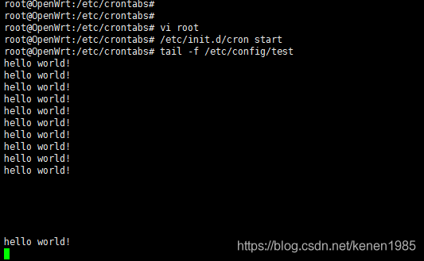

openwrt下crontab定时任务实现
我的需求是需要加个定时执行脚本来监控智能网关运行的进程，一旦网关进程异常关闭，就能立即把它拉起来，从而保证网关运行的可靠性，这里我们用到了crontab服务，OpenWRT系统默认已经加入了crond，仅仅是没有配置默认配置參数，致使服务起不来，下面我们来说如何先来实现每分钟往/etc/config/中test文件中写入"hello world!"

1.编写执行脚本check_process.sh
(1) 在/usr/bin/目录下新建check_process.sh脚本文件：

echo “hello world!” >> /etc/config/test
 

(2) 更改check_process.sh脚本执行权限
chmod 755 check_process.sh

2.配置个人的crontab文件
/etc/crontabs/目录下新建root并输入这行：
*/1 * * * * /usr/bin/check_process.sh
以上意思是每1分钟执行绝对路径/usr/bin/目录下的check_process.sh脚本
  
后续想要编辑root文件可以直接输入crontab –e命令接口

3.开启contab服务
使能contab服务命令：/etc/init.d/cron enable
启动或重启contab服务命令：/etc/init.d/cron start/restart

4.测试
输入tail -f /etc/config/test每隔1分钟打印如下：
  
以上可以实现了每分钟往/etc/config/中test文件中写入"hello world!"的定时任务，下面我们看看如何实现定时监测智能网关的主进程cbox.

5.测试
这里只需要修改下/usr/bin/目录下的check_process.sh脚本文件，如下：
#!/bin/bash

flag=$(ps | grep cbox | grep -v “grep” | wc -l)
if [ $flag = “1” ]
then
echo “cbox RUNNING!”
else
/etc/init.d/cboxd start
fi
是不是很简单！
注意：如果定时任务不执行，请删除该脚本文件中的#!/bash再进行测试。
————————————————
版权声明：本文为CSDN博主「Kenen.Gao」的原创文章，遵循CC 4.0 BY-SA版权协议，转载请附上原文出处链接及本声明。
原文链接：https://blog.csdn.net/kenen1985/article/details/96424575
